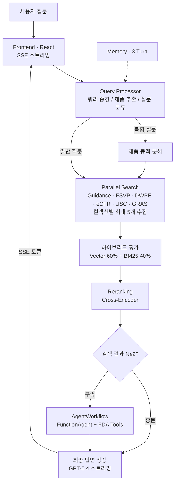

# 🛡️ RISK KILLER - FDA 규제 가이드라인 AI 에이전트

> 한국 식품 기업의 미국 수출을 지원하는 RAG 기반 AI 에이전트

🔗 **라이브 데모:** [https://export-assistant.com](https://export-assistant.com)  
📄 **프로젝트 발표 자료:** [포트폴리오 PDF](./docs/portfolio.pdf)

<!-- 스크린샷 추가 시:
<p align="center">
  
</p>
-->

## 📋 프로젝트 개요

| 항목 | 내용 |
|------|------|
| **목적** | FDA 공식 규제 문서 6,363건 기반 AI 질의응답 시스템 |
| **기간** | 2025.08 ~ 운영 중 |
| **팀 구성** | 2인 공동 개발 |
| **역할** | RAG 파이프라인 설계 및 구현, 검색 최적화, SSE 스트리밍, 프론트엔드/백엔드 풀스택 개발, EC2 배포 및 운영 |

한국 식품 기업이 미국으로 수출할 때 필요한 FDA 규제 정보(라벨링, 검사, 통관, 알레르겐 등)를 AI가 공식 문서 기반으로 답변합니다. 6개 컬렉션에서 하이브리드 검색(Vector 60% + BM25 40%)으로 관련 문서를 찾고, 검색 결과가 부족할 경우 AgentWorkflow가 추가 정보를 수집한 뒤, 출처와 함께 답변을 생성합니다.

## 🏗️ 시스템 아키텍처



## ✨ 핵심 기능

| 기능 | 설명 |
|------|------|
| **하이브리드 검색** | Qdrant 벡터(60%) + Elasticsearch BM25(40%) 병렬 검색, Cross-Encoder Reranker로 정밀 재정렬 |
| **Split LLM 구조** | Agent(GPT-4.1) + 답변 생성(GPT-5.4) + 분류(GPT-5.4-nano) 분리로 비용/속도 최적화 |
| **AgentWorkflow** | LlamaIndex FunctionAgent 기반, 검색 결과 부족 시(N≤2) 6개 컬렉션에서 도구 자동 선택 |
| **SSE 토큰 스트리밍** | 실시간 답변 생성, 단계별 상태 표시 (검색 → 평가 → 생성) |
| **Stop Generation** | 답변 중지 기능, 토큰 보존, 에러 가드 |
| **출처 기반 답변** | Citation 표시, 컬렉션별 색상 뱃지, 참고자료 토글 |

## 🗂️ 데이터셋

6개 컬렉션, 총 6,363건의 FDA 공식 문서:

| 컬렉션 | 문서 수 | 출처 |
|--------|--------|------|
| eCFR (연방규정집) | 1,523 | 미국 연방 전자규정집 |
| DWPE (수입경보) | 987 | FDA Import Alerts |
| FSVP (외국공급자검증) | 856 | FSVP 규정 |
| Guidance (가이드라인) | 1,204 | FDA 산업 가이드라인 |
| GRAS (안전물질) | 634 | GRAS 공지/청원 |
| USC (연방법률) | 714 | 미국 연방법전 |

## 🔧 기술 스택

| 분류 | 기술 |
|------|------|
| **AI/LLM** | GPT-5.4 (답변), GPT-4.1 (Agent), GPT-5.4-nano (분류/필터), LlamaIndex AgentWorkflow |
| **검색** | Qdrant (벡터), Elasticsearch (BM25), Cross-Encoder Reranker, text-embedding-3-small |
| **Backend** | FastAPI, SSE (Server-Sent Events), Python async |
| **Frontend** | React, Tailwind CSS |
| **배포** | Docker, AWS EC2, nginx (프로덕션 빌드) |

## ⚡ 성능 최적화

| 최적화 | 효과 |
|--------|------|
| **FDA Tools 싱글톤화** | 에이전트 생성 2-5초 → 0.001초 |
| **Split LLM** | Agent(GPT-4.1) + 답변(GPT-5.4) 분리로 응답 53-70초 → ~22초 |
| **프로덕션 빌드** | CRA dev server → nginx + 해시 파일명 캐시 버스팅 |
| **Service Worker 정리** | 구형 캐시로 인한 API 응답 캐싱 문제 해결 |

## 🖥️ 스크린샷

<!-- 
스크린샷 추가 시:
### 랜딩 페이지
<p align="center">
  
</p>

### 대화 화면
<p align="center">
  
</p>
-->

> 📸 스크린샷 추가 예정

## 📁 프로젝트 구조

```
risk-killer/
├── frontend/
│   ├── src/
│   │   ├── App.js              # 메인 컨테이너, SSE, 상태 관리
│   │   └── components/
│   │       ├── InputBar.jsx    # 입력창, 중지 버튼, Placeholder 애니메이션
│   │       ├── MessageList.jsx # 메시지 렌더링, Citation 링크
│   │       └── Sidebar.jsx     # 프로젝트 관리
│   ├── nginx.conf              # 프로덕션 빌드 설정
│   └── Dockerfile              # 멀티스테이지 빌드
├── backend/
│   ├── main.py                 # FastAPI, SSE 엔드포인트
│   └── utils/
│       ├── agent.py            # LlamaIndex AgentWorkflow (FunctionAgent)
│       ├── orchestrator.py     # 검색 파이프라인 오케스트레이션
│       ├── tools.py            # FDA 도구 (6개 컬렉션)
│       ├── hybrid_search.py    # 벡터 + BM25 병합
│       └── reranker.py         # Cross-Encoder 재정렬
└── docker-compose.yml
```

## 📝 최근 커밋 히스토리

| 작업 | 내용 | 효과 |
|------|------|------|
| GPT-5.4 마이그레이션 | Split LLM 구조 도입 (Agent/답변/분류 분리) | 응답 53-70초 → ~22초 |
| SSE 토큰 스트리밍 | EventSource 기반 실시간 답변 전송 | 체감 응답 대기 0초 |
| FDA Tools 싱글톤화 | 프로젝트별 재생성 제거 | 에이전트 생성 2-5초 → 0.001초 |
| 프로덕션 빌드 전환 | nginx + 멀티스테이지 Docker + 캐시 버스팅 | 번들 최적화, 캐시 문제 해결 |
| Stop Generation | SSE 연결 외부 제어 + 에러 가드 | 사용자 제어권 확보 |
| UX 개선 | 예시 질문, Placeholder 애니메이션, 모바일 헤더 | 신규 사용자 진입 장벽 감소 |
